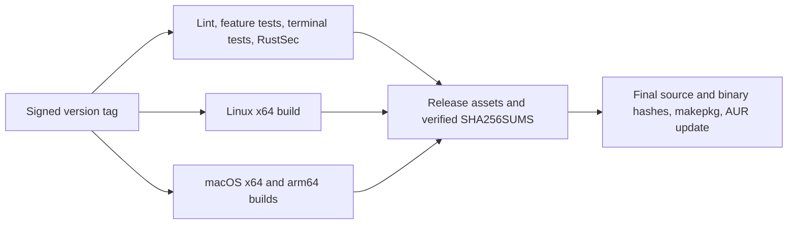

# Releasing jgrep

This repository distributes native binaries through GitHub Releases and source
or binary packages through AUR. Release only from a clean `main` branch after
the required CI checks have passed.

1. Run the checks in `README.md`, including the terminal smoke tests. Review
   `docs/release-readiness.md` for required checks and validation limitations.
2. Bump `workspace.package.version` in `Cargo.toml` and update the new version's
   release notes in `README.md`.
3. Merge the reviewed change to `main`, then create and push an annotated,
   signed tag: `git tag -s vX.Y.Z -m 'jgrep X.Y.Z'` and `git push origin
   vX.Y.Z`.
4. Confirm the Native Builds workflow's release quality gate passed and
   published Linux x64 and macOS x64/arm64 assets plus `SHA256SUMS`.
5. Download the assets from the GitHub Release and run
   `sha256sum -c SHA256SUMS` before publishing the corresponding AUR commit.
   `SHA256SUMS` uses filenames relative to the download directory. On macOS,
   use `shasum -a 256 -c SHA256SUMS`.
6. Download the tagged source archive, then update `pkgver` and the real
   SHA-256 values in both `aur/*/PKGBUILD` files from the final source archive
   and Linux binary. Run `makepkg` on Arch Linux before publishing the AUR
   update. Do not release an AUR update with `sha256sums=('SKIP')`.

Repository administrators must protect `main` and `v*` tags, require the CI
workflow for merges, and restrict release creation to maintainers.
