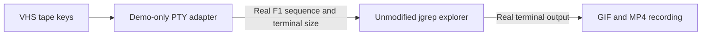

# jgrep VHS demos

These demos are source-controlled terminal recordings for [VHS](https://terminaltrove.com/vhs/).

## Render all demos

Install `vhs`, `ttyd`, and `ffmpeg`, then run:

```bash
bash scripts/render-demos.sh
```

The script checks prerequisites, prebuilds the project, runs adapter tests,
validates all tapes, renders them sequentially, and decodes every output to
verify matching GIF/MP4 dimensions and duration. To render individual demos:

```bash
mkdir -p demos/out
vhs demos/tapes/quickstart.tape
vhs demos/tapes/yaml-and-recursive.tape
vhs demos/tapes/shortcuts-and-slurp.tape
vhs demos/tapes/counts-files-null.tape
vhs demos/tapes/pretty-and-custom-color.tape
vhs demos/tapes/explorer-snapshot.tape
vhs demos/tapes/streaming-highlight.tape
vhs demos/tapes/explore-tui-streaming.tape
vhs demos/tapes/cli-entry-and-recovery.tape
vhs demos/tapes/explorer-complete-save-export.tape
vhs demos/tapes/explorer-help-and-resize.tape
```

All eleven tapes generate both GIF and MP4 files in `demos/out/`. The GIFs are
embedded in the project gallery, while MP4 is available for video playback or
download. Setup build typing is skipped in the recordings, and builds use the locked workspace.

| Demo | Features shown |
| --- | --- |
| Quickstart | Field extraction and jq filter files |
| YAML and recursive | YAML querying and recursive directory search |
| Shortcuts and slurp | Reusable filters, where/path shortcuts and array output |
| Counts, files, null | Counts, matching filenames and generated output without input |
| Pretty and custom color | Object projections and custom log-level coloring |
| Explorer snapshot | Schema/preview snapshots and shell completion generation |
| Streaming highlight | Line-by-line structured logs and level highlighting |
| Live explore TUI | Live filtering, output projection, layout/color/pretty toggles and scrolling |
| CLI entry and recovery | File-only identity, explicit `--filter` with `--where`, missing input and recovery |
| Explorer complete/save/export | Output autocomplete, saved jq file, history and stdout export |
| Explorer help and resize | F1 help, help scrolling/close, 40-column preview and widening to restore fields |

### Recording adapter and isolated state

[VHS 0.11's command vocabulary](https://github.com/charmbracelet/vhs/blob/v0.11.0/token/token.go)
does not provide a function-key command. The two new interactive tapes
therefore use `demos/scripts/explorer_recording.py`, a demo-only PTY adapter:

- The tape's `Ctrl-R` is translated into the actual F1 terminal sequence.
- The tape's `Ctrl-T` switches the app PTY between 40 and 100 columns. The video
  canvas stays wide so both layouts can be compared in the same recording.
- Every other key passes unchanged to the real `target/debug/jgrep` binary.
- History and last-filter state live in a temporary directory removed on exit.
- `Ctrl-S` writes the demonstrated reusable filter to
  `demos/out/explorer-filter.jq`, not to a user profile or an arbitrary file.

These recording chords are not new jgrep shortcuts. Outside the adapter, press
`F1` normally and resize your terminal normally. The adapter uses Python's
standard library and requires Python 3.10 or newer.



Run adapter checks and syntax validation before rendering:

```bash
python3 demos/scripts/test_explorer_recording.py
vhs validate demos/tapes/*.tape
python3 demos/scripts/verify_recordings.py
python3 demos/scripts/test_verify_recordings.py
```

Run the two media checks after rendering. The verifier also rejects files older
than their tape source. Every tape contains `Wait+Screen` assertions for its
expected results. A failed
assertion aborts that recording. These are demo checks, not a replacement for the
Rust suite or the real terminal regression tests.

In headless containers where Chromium cannot use its sandbox, prefix the render command with `VHS_NO_SANDBOX=1`:

```bash
VHS_NO_SANDBOX=1 vhs demos/tapes/quickstart.tape
```

## Try the same commands manually

```bash
cargo build -q -p jgrep
alias jgrep=./target/debug/jgrep

jgrep '.name' demos/fixtures/users.ndjson
jgrep 'select(.age >= 18) | .name' demos/fixtures/users.ndjson
jgrep -w status=active -p name demos/fixtures/users.ndjson
jgrep -s '.role' demos/fixtures/users.ndjson
jgrep -c -w status=active demos/fixtures/users.ndjson
jgrep -l -w status=active demos/fixtures/users.ndjson demos/fixtures/logs.ndjson
jgrep -n '{count:2, files:1, null_input:true}'
env -u NO_COLOR jgrep --pretty '{name, role, city: .address.city}' demos/fixtures/users.ndjson
jgrep '.spec.template.spec.containers[].image' demos/fixtures/k8s/deployment.yaml
jgrep -r 'select(.kind == "Deployment" and .spec.replicas > 2) | .metadata.name' demos/fixtures/k8s
env -u NO_COLOR jgrep -C -w log.level=ERROR demos/fixtures/logs.ndjson
env -u NO_COLOR jgrep -C --color-level-field app.level '{level:.app.level,message,trace_id}' demos/fixtures/app-logs.ndjson
jgrep explore --print --filter status=active demos/fixtures/users.ndjson
jgrep completion bash | sed -n '1,12p'

JGREP_DEMO_DELAY=0.35 demos/scripts/k8s-log-stream.sh |
  env -u NO_COLOR jgrep -C -f demos/fixtures/k8s-log-line.jq

JGREP_DEMO_DELAY=0.45 demos/scripts/k8s-log-stream.sh |
  jgrep explore
```

In the live TUI demo, type `log.level=ERROR`, press `Ctrl-F`, `Ctrl-L`, and `Ctrl-G`, press `Ctrl-O`, then type `{level:.log.level,message,trace_id:.trace.id}` to switch from filtering records to a wide multi-field log preview. The simulated Kubernetes logs use nested `trace.id`, so the projection names that path explicitly. Use `PageUp`/`PageDown` or the mouse wheel to scroll the preview.
