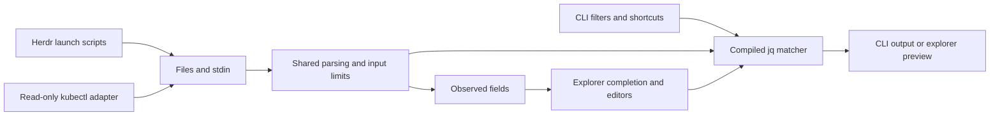
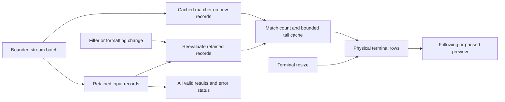

# Development notes

## Module boundaries

- `crates/jgrep` owns the executable, integration tests and benchmarks.
- `crates/jgrep-core` owns argument handling, input discovery/parsing, shortcut
  translation, jq evaluation and output formatting.
- `explore` and `schema` add terminal interaction and observed-field inference.
- `k9s` adapts read-only kubectl output to the explorer. Herdr scripts launch the
  same binary; neither integration implements its own filter engine.
- `completion`, `explore` and `yaml` are optional capabilities. Shared changes
  must remain valid for the supported feature configurations.

## Explorer behavior

Filter selects records; Output projects their fields. Completion inserts literal
jq lookups, preserving dotted or unusual key identity. Invalid UTF-8 object keys
disable schema completion with a diagnostic rather than crashing the explorer.
Manually authored jq remains trusted code, without a general execution timeout.

Streaming drains at most 512 events per UI cycle. A full batch bypasses the idle
keyboard poll delay; bounded batches still allow keyboard/resize handling.
Queued keystrokes are handled in bounded groups and refresh once per group.
Save/print/jq-export actions flush pending edits before using the generated filter.
Unchanged compiled filters evaluate only appended records. Schema is inferred
from the first bounded sample and stops refreshing once that sample is full.
The preview caches the latest bounded result groups and counts all matches.
Upward scrolling or Ctrl-T freezes the visible window, not ingestion; resuming
copies the latest cache. Filter/format changes rebuild it from retained records.
Accepted records remain within the input budget and export is not preview-limited.
Per-record evaluation errors preserve good results and are reported separately
from compile errors; export reports partial success with exit code 2.
Preview limits bound display, not jq computation.

Below 80 columns, the explorer hides its field panel and keeps essential actions
visible. F1 opens modal help; Esc closes help before it quits the explorer.
Help captures edit/save/export actions and adapts its scroll bounds after resize.

Preview layout is cached as physical terminal rows. The same grapheme-aware
wrapping controls rendering, scroll limits, page navigation and tail positioning.
Color badges and continuation indentation are part of those rows, not a second
terminal-write overlay. A resize invalidates layout without reevaluating jq.
The renderer honors the initial color policy and explicit interactive toggles,
restoring its previous global color setting on exit. Keyboard editing measures
terminal columns and moves/deletes complete graphemes using Ratatui's text APIs.

Display encodes document control characters before applying application styles.
Explicit raw extraction and result export retain raw-string semantics. Tests must
preserve both boundaries, normal terminal restoration, error reporting and exit
codes. See [README.md](../README.md) for shortcuts and safety limits.

## Integration contracts

Herdr configuration and state are separate and private by default. Configuration
ownership and write permissions are checked before use. Plugin launches must
remain useful without Herdr; it is an optional integration.

The k9s bridge passes explicit context, namespace and resource arguments, avoids
shell evaluation, excludes Secrets, bounds captured input and reaps kubectl when
the viewer exits. Logs use `explore --stream-json` so the viewer opens before the
first record; resource JSON still uses buffered/autodetected input. Filter edits,
modal help and Preview layout changes do not stop ingestion.
Installation refuses implicit overwrite. Explicit `--update` stages and preflights
the replacement, copies private filter state, and backs up the old snapshot outside
scanned plugin directories. A failed preflight leaves the existing plugin untouched.
The optional `scripts/test-k9s.py` checks actual keyboard launch with real k9s and
kubectl against an isolated synthetic localhost API, not a real cluster.

`Dockerfile.macos` cross-links native Mach-O executables with the Rust toolchain's
bundled LLVM linker. `scripts/build-macos.sh` passes the local Apple SDK as a
read-only named context, smoke-tests native host output and optionally invokes the
Rust installer. No SDK or Rust toolchain is included in the exported artifact.
See the [Herdr README](../plugins/herdr-jgrep/README.md) and
[k9s README](../plugins/k9s-jgrep/README.md) for configuration and migration.

Use [release validation](release-readiness.md) for checks and their limitations.
