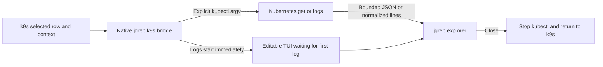

# jgrep integration for k9s

A read-only bridge from selected k9s rows to the real `jgrep explore` TUI.
Requires k9s 0.40.9 or newer, kubectl, and jgrep with the explore feature.
The bridge and installer are native Rust (`jgrep k9s`), no Python runtime or
extra packages are needed. The plugin-directory contract is documented in the
[official k9s plugin guide](https://k9scli.io/topics/plugins/).

## Actions

| View | Key | Action |
| --- | --- | --- |
| Pods | `Shift-J` | Follow the last 1,000 log lines and new lines from all containers |
| Containers | `Shift-K` | Follow logs for the selected container in its parent pod |
| Pods, deployments, statefulsets, daemonsets, services, jobs, cronjobs | `Shift-U` | Explore the selected resource as JSON |

Use uppercase `J`/`K`/`U`. The plugin uses distinct shortcuts to avoid ambiguity.
Pod `J` and container `K` intentionally override built-in
bindings in those views so the plugin is reachable; customize the installed YAML
if you need the original bindings. The entries also appear in k9s help (`?`). Inside jgrep,
`F1` explains filtering and output, `Esc` returns to k9s, and `Ctrl-S` saves a
filter. The TUI opens immediately even when a pod has never emitted a log line.
Set `Filter` to `level=ERROR`, switch with `Ctrl-O`, and set `Output` to `message`;
matching new logs continue appearing. `Ctrl-G` enlarges Preview, `Ctrl-T` freezes
only the displayed window, and F1 help does not stop ingestion. `Esc` or `Ctrl-C`
also works during the initial wait. The plugin does not create pods, exec into containers, change the current
context, edit workloads, or read Secret resources.

JSON object logs retain their fields. Plain lines and JSON scalar/array logs are
wrapped as `{"message": ...}` so mixed logs remain searchable without parse
errors. Multi-line structured logs are treated line-by-line, not reassembled.
All-container logs do not add kubectl prefixes, which would break JSON input,
so log sources are not automatically labeled. Use the container action when
source identity matters.

## Install

For a Docker-only native build on macOS (no host Rust or Python):

```bash
bash scripts/build-macos.sh --install
# If the managed plugin already exists:
bash scripts/build-macos.sh --install --update
```

Requires Docker Desktop and a local Apple Command Line Tools SDK. Missing k9s or
kubectl is installed through Homebrew only with `--install`. See the root
[build instructions](../../README.md#native-macos-docker-build-and-k9s-installation).

First run `k9s info` and use its configuration directory, not the kubeconfig
directory. Build and install from the repository root:

```bash
cargo build --release --locked -p jgrep
# macOS default, verify with k9s info first:
target/release/jgrep k9s install \
  --config-dir "$HOME/Library/Application Support/k9s"
```

For another installation use `--config-dir /path/from/k9s-info`. That directory
must also be a k9s plugin search location. When overriding `K9S_CONFIG_DIR`, align
`XDG_CONFIG_HOME` so its `k9s/plugins/` points to that directory; changing the main
config-file location alone does not relocate all plugin search paths.
The installer creates its managed `plugins/jgrep/` and private `jgrep-backups/`
staging/backup directories there. It copies the tested binary
and rendered YAML there, using absolute executable paths, so moving the
repository does not break the plugin. Existing `plugins.yaml`, hotkeys and other
plugins are left untouched. The installer refuses to overwrite its target.
Restart k9s after installation. Other plugin files are not modified; choose unique
`shortCut` values in the installed YAML if other plugins already use these keys.

This is a binary snapshot. Rebuilding the repository does not update the
installed copy. Use `jgrep k9s install --update --config-dir ...` to stage a tested
replacement, preserve regular files in `state/`, and move the old snapshot to
`jgrep-backups/jgrep-<timestamp>/` outside the scanned plugin directories. Without
`--update`, installation still refuses to overwrite an existing plugin. The new
YAML uses default shortcuts; restore any custom bindings from the backup. Do not
update while an explorer session is running. Symlinked plugin directories/state
are not accepted. Alternatively move the old directory outside `plugins/` and
install again, copying only its `state/` afterward.
To migrate an existing Python installation, back it up outside `plugins/`, run
the native installer above, then copy only its `state/` into the new installation.
The old `launcher.py` is not used by the new plugin.

## Safety and limits

- Context, namespace, selection, container and kubeconfig come from k9s, not
  kubectl's implicit current context. Merged `KUBECONFIG` lists are preserved.
- No shell evaluation: resource names and context values are process arguments.
- Resource reads use a 15-second request timeout. Logs start with `--tail=1000`.
- Sessions retain at most 10 MiB of normalized input. Individual log lines are
  limited to 1 MiB. A reached limit is reported, reopen the session to continue.
  Structured log lines deeper than 128 levels are preserved as plain text.
- Exiting jgrep terminates even an idle kubectl log follower. Fetch/RBAC errors
  remain errors rather than being hidden by a successful viewer exit.
- Input logs/resource bodies are never saved by this bridge. History, last jq and
  explicitly saved filters live under its private `state/` directory. History
  records filters, not data, but filters may themselves contain sensitive values.
- Enter/Ctrl-Y explicitly print results/jq in the terminal as usual. Treat pod
  logs and exported resources as potentially sensitive even though Secrets are
  excluded. Do not record real cluster data for demo videos.



## Verification without a cluster

```bash
cargo test --locked --workspace --all-features
```

Rust tests exercise real jgrep and a stub kubectl, covering mixed logs, resources,
explicit routing, container selection, kubeconfig handling, malformed selections,
denied requests, bounded input, idle-process cleanup and isolated installation.
`python3 scripts/test-tui.py target/debug/jgrep` additionally exercises the bridge
in a real pseudo-terminal with mixed logs, F1 help, saved filters and idle-process
cleanup, silent startup, combined Filter/Output, live-tail pause/resume and complete
export. To exercise actual k9s keyboard navigation and kubectl, with isolated
configuration and a synthetic Kubernetes API bound only to localhost:

```bash
python3 scripts/test-k9s.py dist/macos-arm64/jgrep
```

This optional test requires k9s and kubectl and launches the installed plugin via
`Shift-J`, edits Filter/Output, resizes Preview, checks later logs, saves the filter
and returns to k9s. It also exercises resource exploration with `Shift-U` and
container logs with `Shift-K`. It never loads host credentials or contacts a real cluster.
These checks do not establish real-cluster connectivity or RBAC compatibility.
Python is used only by this optional PTY test harness and other development/demo
tools, never by the installed bridge or installer.
